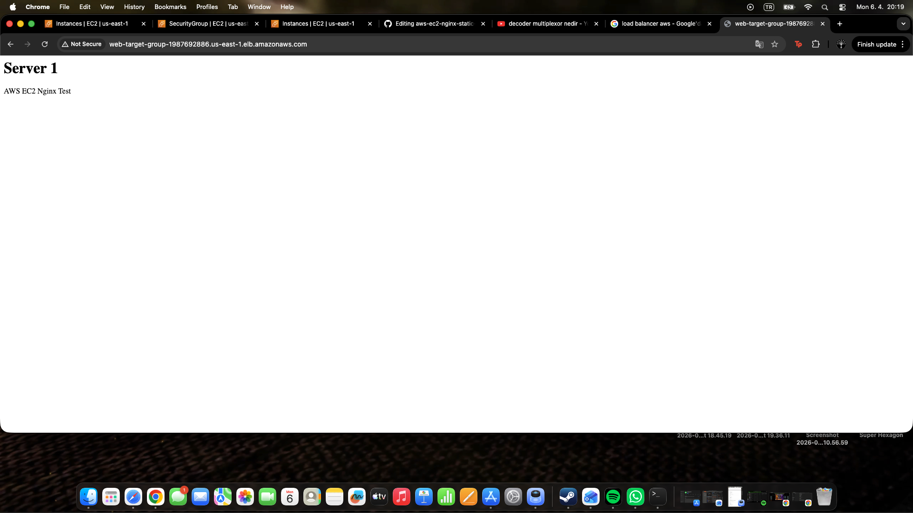
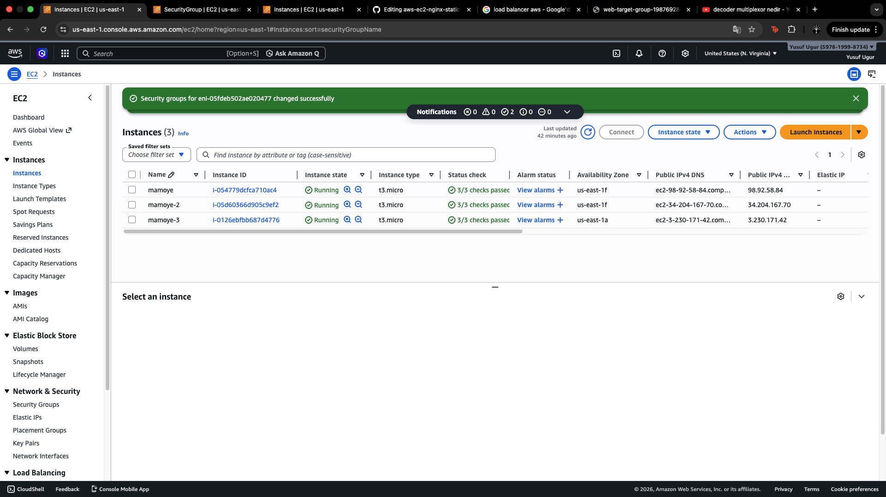

# AWS EC2 Nginx Static Website

This project shows how I deployed a static website on an AWS EC2 instance using Ubuntu and Nginx.

## Project Overview

In this project, I:

- Launched an AWS EC2 instance
- Connected to the server via SSH
- Used Ubuntu as the server environment
- Deployed a static HTML website
- Configured Nginx to serve the website
- Updated AWS Security Group rules to allow HTTP traffic
- Made the website publicly accessible through the EC2 public IP

## Technologies Used

- AWS EC2
- Ubuntu
- Nginx
- HTML
- SSH

## Screenshots

### Website


### EC2 Instance


### Security Group


## What I Learned
- How to launch and access an EC2 instance
- How to connect to a remote Linux server with SSH
- How to host a static website with Nginx
- How Security Groups affect inbound web traffic
- Basic deployment workflow on AWS

## Result
The static website was successfully deployed and made publicly accessible from the browser using the EC2 public IP address.

## Author

Yusuf

## Project Structure

```text
.
├── index.html
└── README.md
